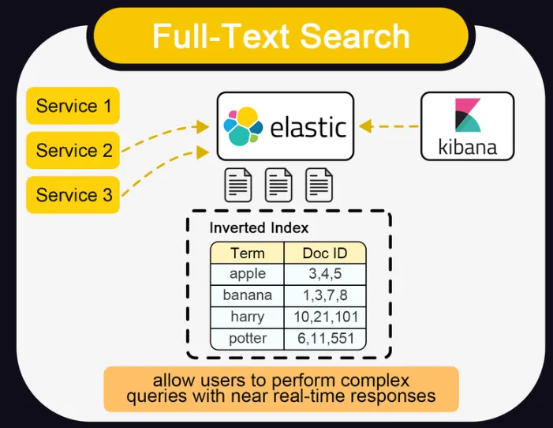
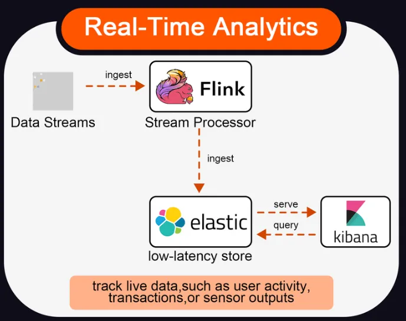
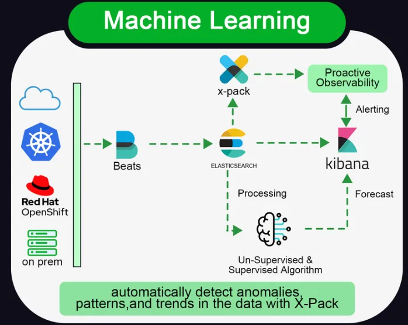
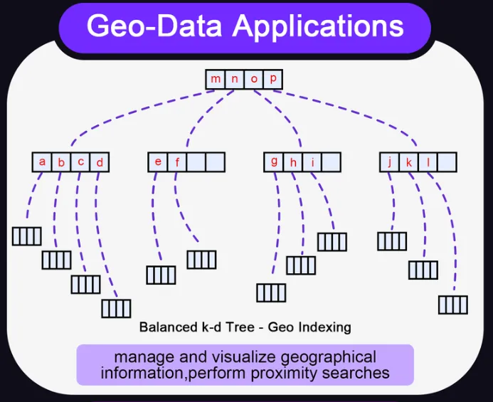
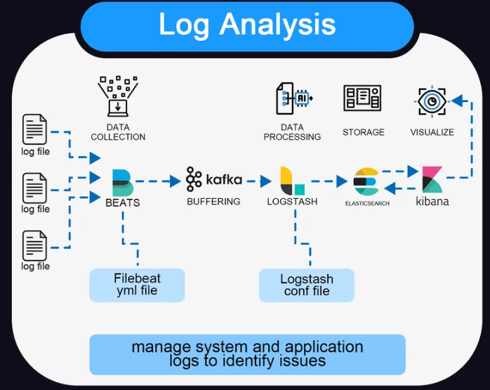

# Elasticsearch

## Scenarios

## Concepts

### Inverted index

a database index storing a mapping from content, such as words or numbers, to its locations in a table, or in a document
or a set of documents. The purpose of an inverted index is to allow fast full-text searches.

### Replicas

### Shards

### Tokenizer

A tokenizer receives a stream of characters, breaks it up into individual tokens (usually individual words), and outputs
a stream of tokens.

### Mapping

Mapping is the process of defining how a document, and the fields it contains, are stored and indexed.