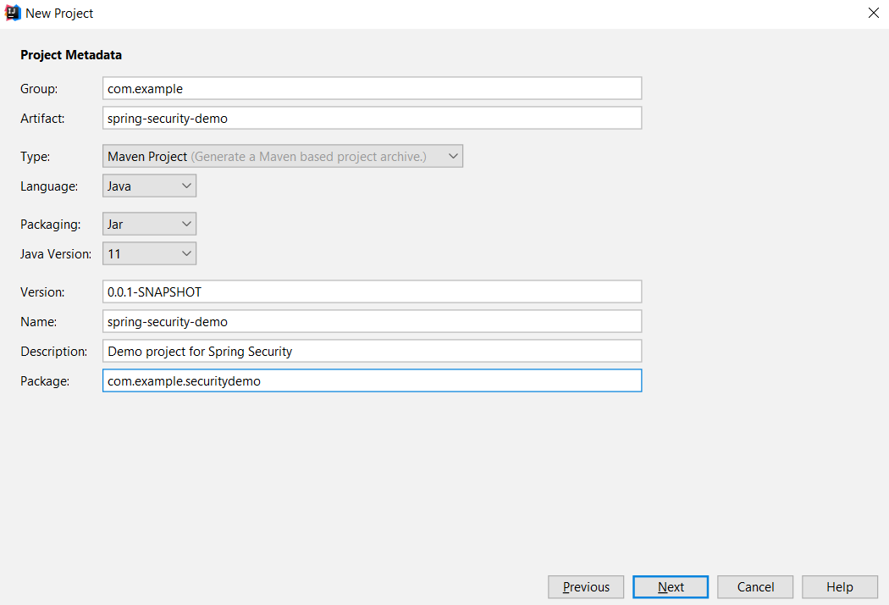
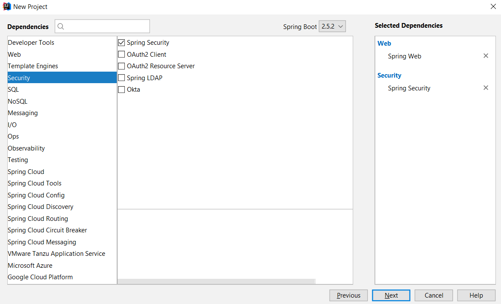

# Build your first Spring Security project in IntelliJ IDEA

1. File --> New --> Project.

2. Choose `Spring Initializr` on the left. Select your own `Project SDK`, and remain `Initializr Service URL` as `Default`.

    
    
3. Config project metadata.

    
    
4. Choose `Web` on the left, and tick `Spring Web` on the right;

   Choose `Security` on the left, and tick `Spring Security` on the right.
   
   