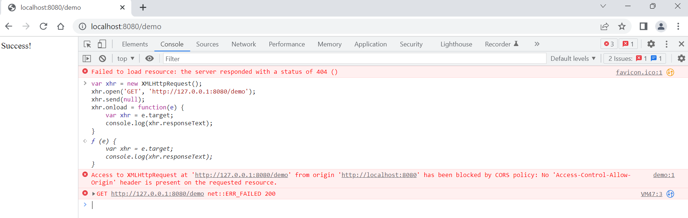

# How to test CORS

1. Open `Google Chrome`, right click and choose `Inspect`;

2. Click `Console`, paste the following code, then enter;

    ```javascript
    var xhr = new XMLHttpRequest();
    xhr.open('GET', 'http://127.0.0.1:8080/demo');
    xhr.send(null);
    xhr.onload = function(e) {
        var xhr = e.target;
        console.log(xhr.responseText);
    }
    ```

3. The result should be like this:

    