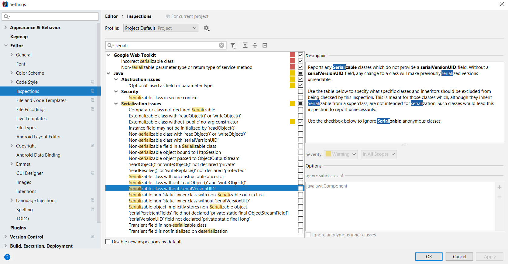
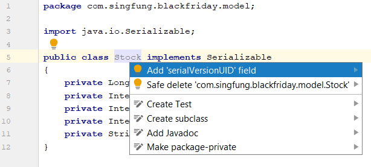

# Automatically Generate serialVersionUID in IntelliJ IDEA

1. File --> Settings --> Editor --> Inspections --> Java --> Serialization issues --> Serializable class without 'serialVersionUID'

2. Left click the class, `Alt` + `Enter`, Add 'serialVersionUID' field.
