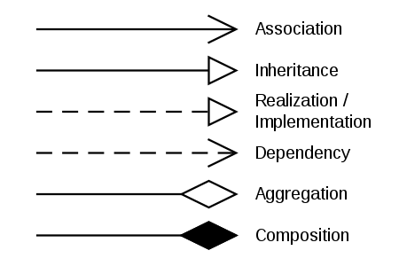

# Class diagram

## UML Relations Notation

Reference: https://upload.wikimedia.org/wikipedia/commons/thumb/9/93/Uml_classes_en.svg/450px-Uml_classes_en.svg.png

**Association**: represent the static relationship shared among the objects of two classes, e.g. a flight class is associated with a plane class bi-directionally. The dependent class is an instance of the independent class.

**Inheritance**: a subclass **is a** kind of superclass.

**Implementation**: a class implements the behavior specified by an interface.

**Dependency**: one class depends on another if the independent class is a parameter variable or local variable of a method of the dependent class.

**Aggregation**: a variant of the "has a" association relationship, e.g. Library and Students. Students can exist without library, and library can exist without students as well.

**Composition**: similar to aggregation. However, when the container is destroyed, the contents are also destroyed, e.g. a university and its departments.