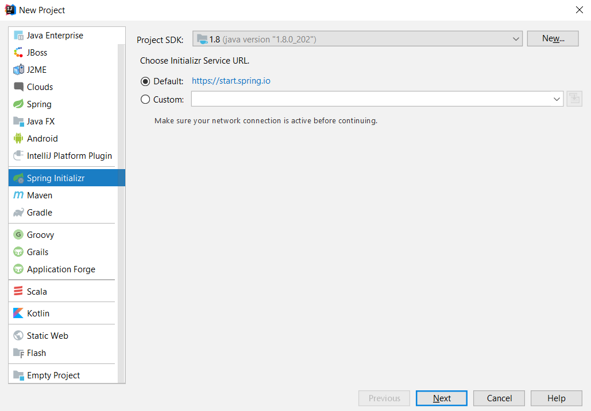
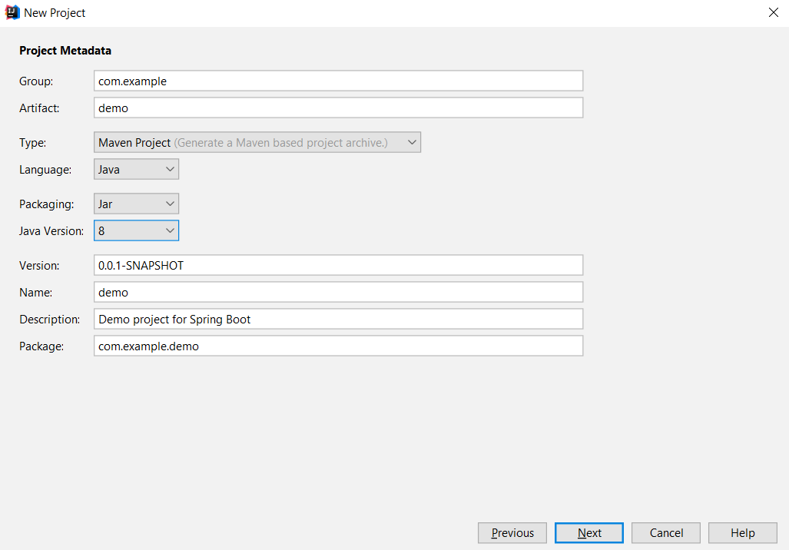
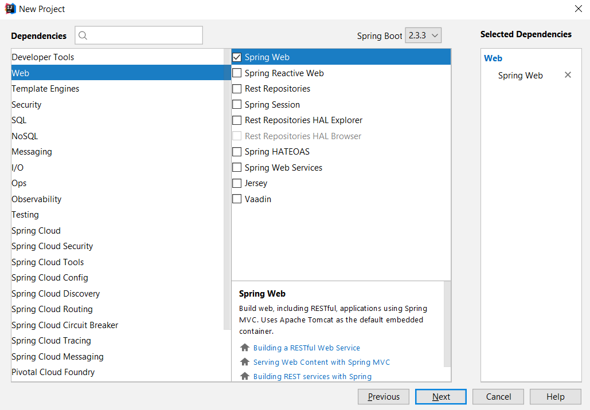
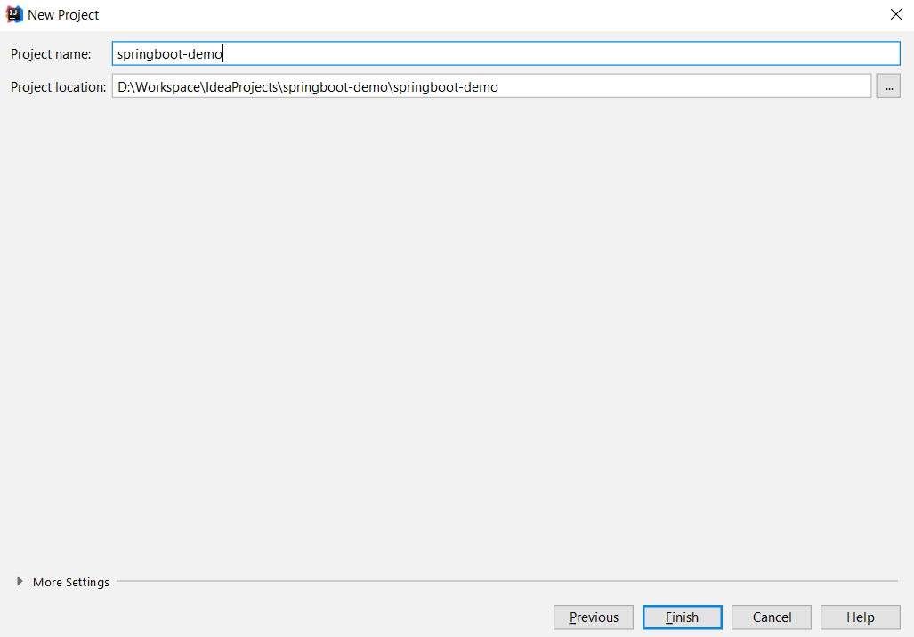
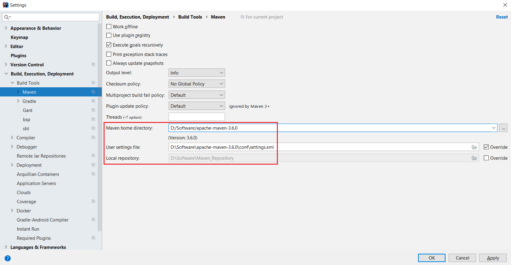
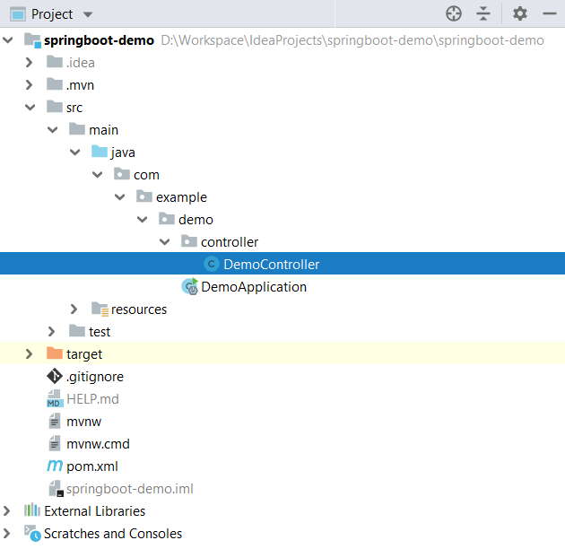
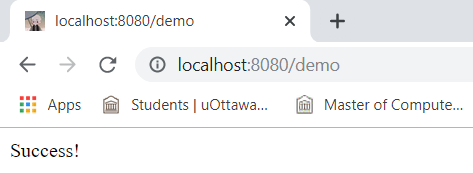

# Build your first Spring Boot project in IntelliJ IDEA

1. File --> New --> Project.

2. Choose `Spring Initializr` on the left. Select your own `Project SDK`, and remain `Initializr Service URL` as `Default`.   



3. `Group` and `Artifact` combine together and become `Package`.   



4. Choose `Web` on the left, and choose `Spring Web` on the right.   



5. Define your `Project name` and press Finish.   



6. File --> Settings --> Build, Execution, Deployment --> Build Tools --> Maven. Replace `Maven home directory`, `User settings file` and `Local repository` with your own ones.   


7. Create a Package `controller` under `demo`, and create a class called `DemoController` under `controller`.   



8. The content of class `DemoController` is as follows.
```
package com.example.demo.controller;

import org.springframework.web.bind.annotation.GetMapping;
import org.springframework.web.bind.annotation.RestController;

@RestController
public class DemoController
{
    @GetMapping("demo")
    public String demoMethod()
    { return "Success!"; }
}
```

9. Run `DemoApplication`, and open `http://localhost:8080/demo` in Browser. Your first Spring Boot project runs successfully!   


